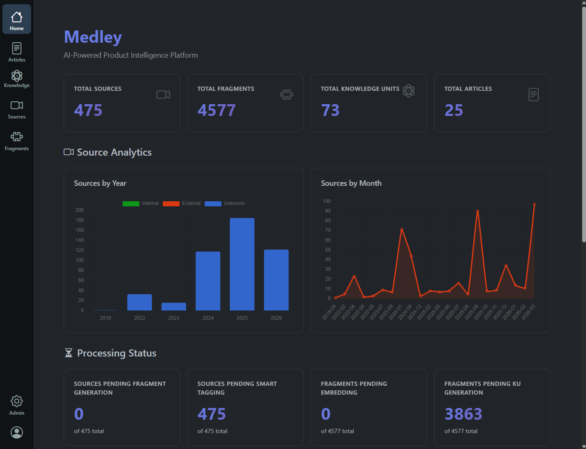
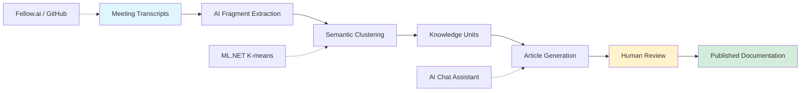
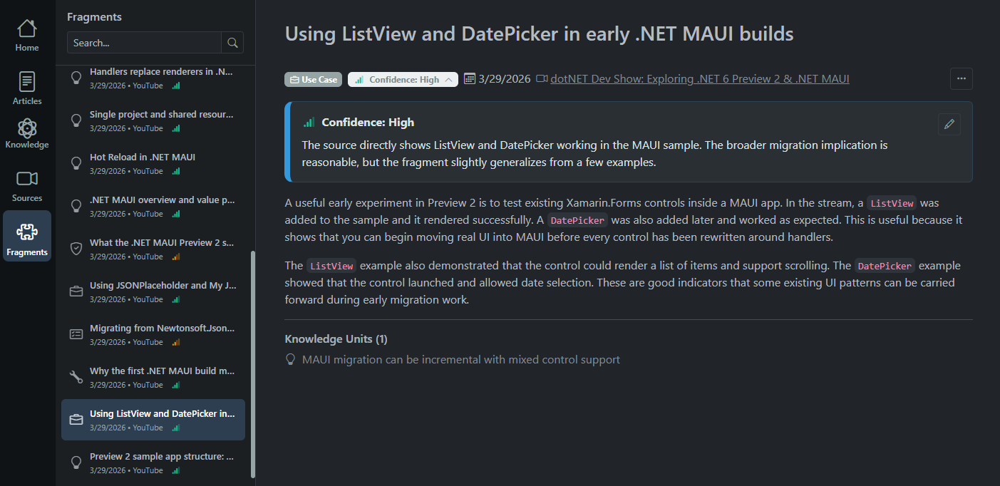
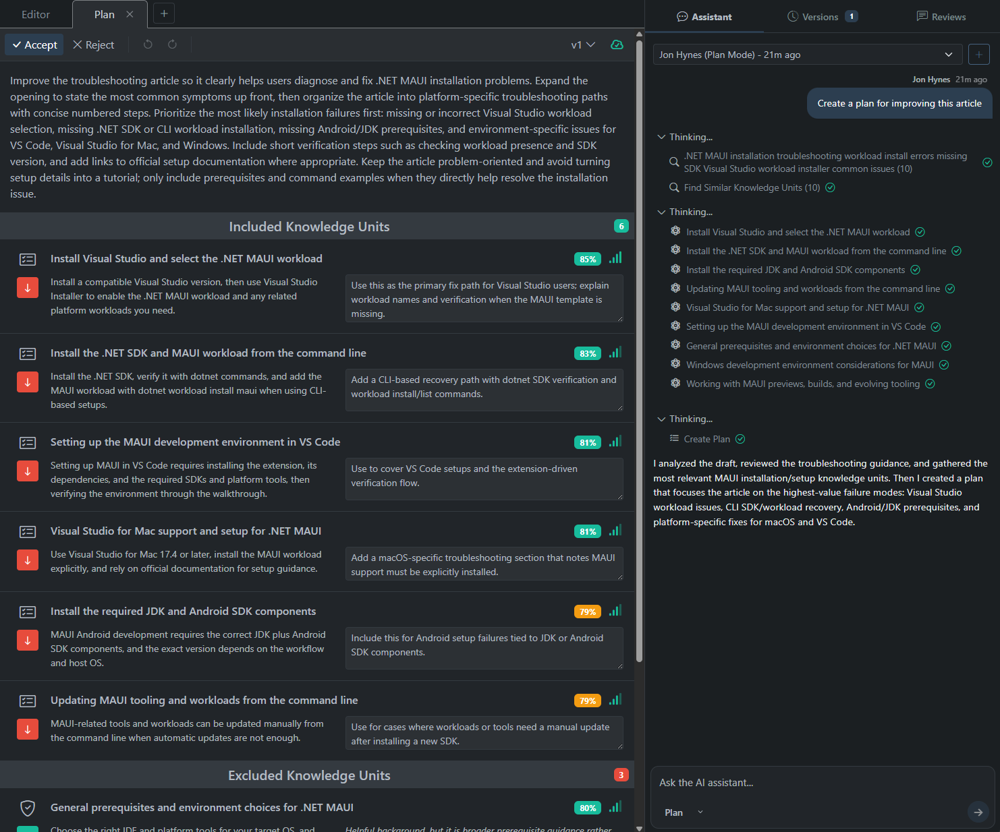

# Medley

> Developers hate writing documentation, but they desperately need it. Medley solves this paradox.

AI-powered product intelligence platform that transforms meeting transcripts and organizational conversations into structured documentation through human-AI collaboration.




*Main dashboard showing fragment processing and article generation pipeline*

## The Problem

Critical product insights get buried in meeting transcripts, scattered across chat histories, and lost in ticket systems. Meanwhile, documentation becomes outdated the moment it's written, and developers would rather code than write docs.

**Medley captures the knowledge that already exists in your team's conversations and turns it into living documentation.**

## How It Works



## Key Features

### AI-Powered Fragment Extraction
Extract insights from transcripts using configurable AI providers (AWS Bedrock, Anthropic, OpenAI). Identifies product features and business insights from client feedback automatically.



### Semantic Clustering with ML.NET
Groups related fragments using k-means clustering on vector embeddings to identify patterns, prioritize issues by frequency, and surface emerging trends. pgvector is used for similarity search during article generation.

### Interactive Article Chat
Dual-mode AI conversation for documentation:
- **Agent Mode** - Direct article editing, Q&A, and plan implementation
- **Planning Mode** - Generate improvement plans with knowledge unit recommendations



### Knowledge Unit Synthesis
Aggregates related fragments into validated knowledge units that serve as building blocks for comprehensive documentation.

### Background Processing & Monitoring
Hangfire-powered async jobs with real-time dashboard for tracking extraction, clustering, and generation tasks.

- Key pipeline processes currently triggered through hangfire dashboard: Fragment Extraction, Custering Embedding Generation, Fragment Clustering, Knowledge Unit Generation, Knowledge Unit Embedding Generation

### Integration Ecosystem
- **Fellow.ai** - Meeting transcript sync and processing
- **GitHub** - Repository connection management (planned)
- **Zendesk** - Support ticket integration
- **Slack** - Chat message ingestion (planned)

## Technical Highlights

### Clean Architecture with Pluggable Providers
Built on Clean Architecture principles with dependency inversion, making it easy to swap implementations:

```
Domain (Core) ← Application (Services) ← Infrastructure (Implementations) ← Web (UI)
```

- **Pluggable AI Providers** - Switch between AWS Bedrock, Anthropic, OpenAI, or custom providers via configuration
- **Pluggable Storage** - AWS S3 or local filesystem through `IFileStorageService`
- **Pluggable Embeddings** - Ollama (local) or OpenAI via `IEmbeddingHelper`
- **Database Agnostic** - PostgreSQL by default, easily swap to SQL Server or MySQL

### Technology Stack

**Backend**
- ASP.NET Core 10.0 (MVC + Razor)
- PostgreSQL 16+ with pgvector extension
- Entity Framework Core 10.0
- ASP.NET Core Identity
- Hangfire for background jobs
- SignalR for real-time updates

**AI/ML**
- AWS Bedrock, Anthropic, or OpenAI (pluggable)
- Ollama or OpenAI embeddings
- pgvector for semantic similarity search
- Custom RAG implementation

**Frontend**
- Vue.js 3 with Vite
- TipTap rich text editor
- Chart.js for analytics
- Bootstrap 5 (auto dark/light mode)

**Infrastructure**
- Docker Compose for local development
- Serilog for structured logging
- AWS S3 for file storage

## Architecture

```
src/
├── Medley.Domain/          # Core entities, no external dependencies
├── Medley.Application/     # Business services, interface abstractions
├── Medley.Infrastructure/  # EF Core, AWS, Fellow.ai, GitHub integrations
└── Medley.Web/            # MVC controllers, Razor views, Vue components
```

Interface abstractions (`IAiProcessingService`, `IFileStorageService`, `IRepository<T>`) enable easy mocking for tests and swapping implementations without code changes.

## Getting Started

### Prerequisites

- [.NET 10 SDK](https://dotnet.microsoft.com/download)
- [PostgreSQL 16+](https://www.postgresql.org/download/) with pgvector extension
- [Node.js 18+](https://nodejs.org/) (for frontend build)
- [Docker Desktop](https://www.docker.com/products/docker-desktop) (optional, for containerized setup)
- AI provider credentials (AWS Bedrock or OpenAI API key)
- Embedding provider (Ollama for local, or OpenAI)

### Quick Start with Docker

```bash
# Clone the repository
git clone https://github.com/jehhynes/medley.git
cd medley

# Start PostgreSQL and Redis
docker-compose up -d

# Configure your AI provider
cp src/Medley.Web/appsettings.json src/Medley.Web/appsettings.Development.json
# Edit appsettings.Development.json with your API keys

# Build frontend assets
cd src/Medley.Web/ClientApp
npm install
npm run build

# Run Medley.Web in Visual Studio
```

### Configuration

Key settings in `appsettings.json`:

```json
{
  "AI": {
    "Provider": "Bedrock"
  },
  "Bedrock": {
    "ModelId": "us.anthropic.claude-sonnet-4-5-20250929-v1:00",
    "Region": "us-east-1"
  },
  "Embedding": {
    "Provider": "Ollama",
    "Model": "qwen3-embedding:4b"
  },
  "FileStorage": {
    "Provider": "Local"
  }
}
```

## Key Technical Decisions

- **Clean Architecture** - Maintainable, testable, and flexible
- **pgvector** - Native PostgreSQL vector similarity search (no external vector DB needed)
- **Pluggable Providers** - Interface-driven design and dependency inversion
- **Hangfire** - Reliable background processing with built-in monitoring dashboard
- **SignalR** - Real-time updates without polling overhead
- **Vue.js** - Provides native app-like responsiveness in the front-end

## Technical Challenges

### Navigating an Immature AI Ecosystem

Building on `Microsoft.Extensions.AI` exposed a recurring problem in the current AI tooling landscape: documentation is sparse, ownership is unclear, and errors are hard to attribute to the right layer. When integrating Anthropic for structured output via `Microsoft.Extensions.AI`, it was difficult to determine whether a given failure was a bug in the MS abstraction layer, a gap in Anthropic's implementation of the interface, or a misconfiguration — because the documentation to answer that question simply didn't exist.

After investing significant time debugging across multiple layers with no clear path forward, the pragmatic call was to switch to another provider that worked properly for structured output (such as OpenAI). The pluggable provider design made this a configuration change rather than a rewrite, which validated the architecture.

### Extracting Signal from Noisy Transcripts

Meeting transcripts are messy. A one-hour session might have a dozen participants, long stretches of unrelated conversation, hedging language, and half-formed ideas mixed in with real product decisions. The challenge was teaching the AI to identify product features and business insights specifically — without stripping so much context that the extracted fragment loses meaning on its own.

Over-aggressive filtering produces terse knowledge units that are technically accurate but lack the surrounding context needed to synthesize a coherent article. Under-filtering produces noise and more content than can realistically be consumed downstream. 

The extraction prompts were deliberately left configurable. Medley was built by developers, for developers, with the expectation that prompt refinement is an ongoing process as the system is used on real data.

### Scalable Semantic Clustering

The clustering step needs to group fragments that discuss the same topic across many meetings into a single knowledge unit — without creating duplicates or missing related entries. The straightforward approaches didn't hold up:

- Some algorithms tested (such as HAC) required an n² complexity which worked for small datasets but broke down at scale.
- Other algorithms (such as DBSCAN) produced poor cluster distribution: some clusters with a handful of fragments, others with hundreds.

The solution I landed on is a **recursive k-means bucketing** strategy (`KMeansBucketingService`). Rather than computing a single global clustering, it processes fragments through a queue: any bucket exceeding 90 fragments is split using k-means (targeting ~45 per bucket) and re-enqueued. This continues until all buckets are within range. The approach gives well-distributed cluster sizes, scales linearly in practice, and uses ML.NET's k-means implementation with cosine distance for semantically meaningful groupings.


## License

See [LICENSE.md](LICENSE.md)

