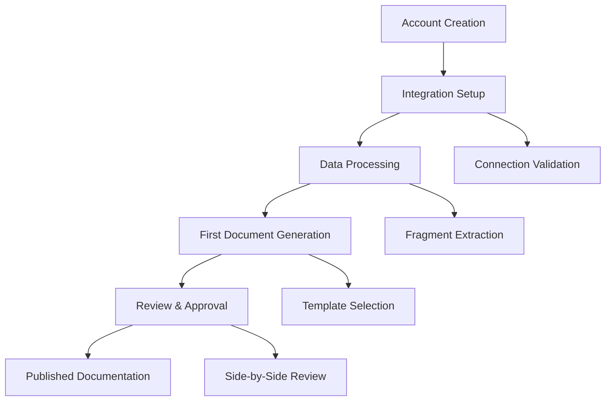
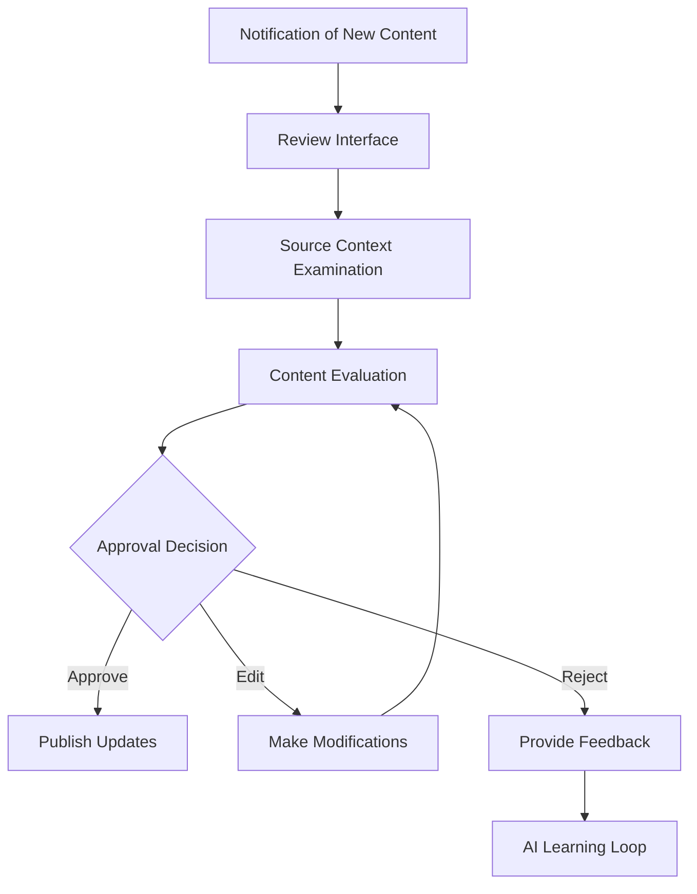
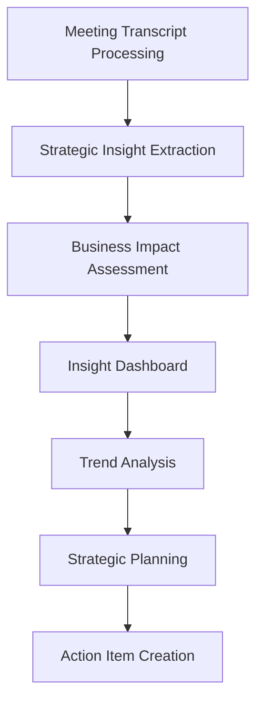
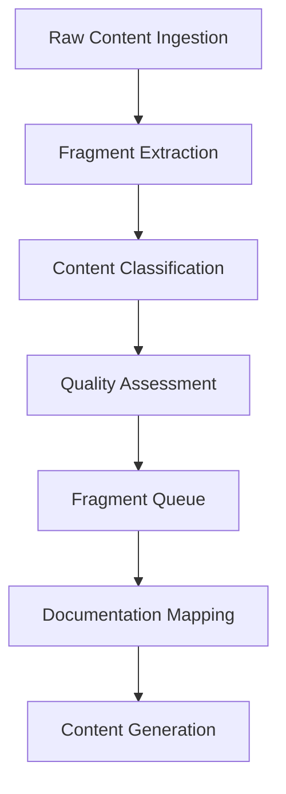
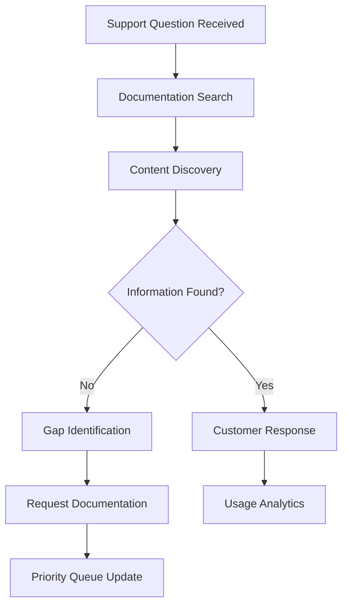
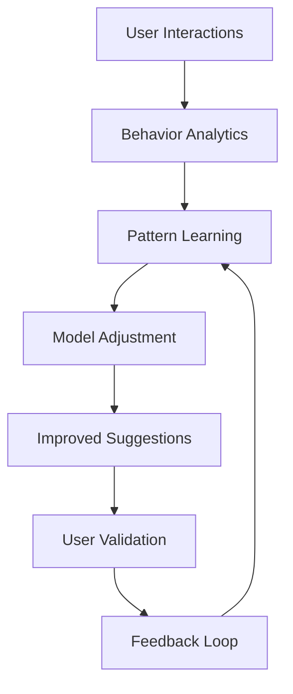

# Medley UX/UI Specification

_Generated on 2025-10-17 by Medley Developer_

## Executive Summary

**Project:** Medley - AI-Powered Product Intelligence Platform  
**Type:** Level 3 Complex Web Application (SaaS)  
**Platform:** Web-responsive application optimized for desktop, functional on tablets/mobile  
**Target Users:** Development teams (5-50 developers), Product Managers, Support teams  

**Core Value Proposition:** Transform existing organizational conversations (meetings, code commits, chat) into structured, actionable documentation through human-AI collaboration. The platform addresses the fundamental paradox that developers hate writing documentation but desperately need it.

**Key UX Challenge:** Make the AI review process feel productive rather than burdensome - this is the critical success factor for adoption.

**Primary User Journeys:**
1. **First-Time Setup:** Connect Fellow.ai → Process meetings → Generate first documentation → Review and approve
2. **Ongoing Maintenance:** Continuous ingestion → Proactive updates → Pattern discovery → Documentation evolution  
3. **Insight Discovery:** Fragment exploration → Pattern analysis → Business insight extraction → Documentation gap identification
4. **Insight Management:** Review AI-generated insights → Validate business relevance → Track insight implementation → Measure impact

**Technical Context:** ASP.NET Core MVC with PostgreSQL, integrating with Fellow.ai, GitHub, and Claude 4.5 via AWS Bedrock.

---

## 1. UX Goals and Principles

### 1.1 Target User Personas

### Primary Persona: Development Team Lead / Product Manager
**Profile:** Technical leads, product managers, engineering managers in teams of 5-50 developers  
**Goals:** Reduce documentation burden while improving quality, capture insights from team conversations  
**Pain Points:** Documentation backlogs, scattered product knowledge, time constraints, preference for coding over writing  
**Current Behavior:** Relies on tribal knowledge, uses multiple disconnected tools, creates documentation only when forced  
**Success Criteria:** Can generate useful documentation in under 2 hours, review AI content in under 10 minutes per document

### Secondary Persona: Support & Customer Success Team Member  
**Profile:** Customer-facing roles dealing with product questions daily  
**Goals:** Access current, accurate documentation for customer interactions  
**Pain Points:** Outdated documentation, repetitive explanations, escalations that could be self-service  
**Current Behavior:** Creates informal knowledge bases, repeatedly explains same features  
**Success Criteria:** 40% reduction in documentation-related support tickets, faster issue resolution

### 1.2 Usability Goals

**Primary Usability Goals:**

1. **Efficiency for Time-Constrained Users:** Sub-2-second response times, streamlined workflows with bulk operations and keyboard shortcuts
2. **Trust Through Transparency:** Users can always see source material that informed AI decisions - "glass box" approach builds confidence
3. **Productive Review Experience:** Review process feels valuable, not burdensome - the critical UX success factor
4. **Rapid Time-to-Value:** Users see meaningful results within 48 hours of setup, first useful documentation in under 2 hours
5. **Error Prevention:** Clear validation, confirmation dialogs for destructive actions, and recovery guidance
6. **Accessibility Compliance:** WCAG AA standards with keyboard navigation and screen reader support

### 1.3 Design Principles

**Core Design Principles:**

1. **Transparency First:** Users can always see the source material that informed AI decisions through a "glass box" approach, building trust through visibility rather than hiding the AI process

2. **Efficiency for Busy Teams:** Streamlined workflows that respect developers' time constraints, with bulk operations, keyboard shortcuts, and progressive disclosure to minimize cognitive load

3. **Human-AI Partnership:** The interface positions AI as an intelligent research assistant that presents findings clearly, allowing rapid review and editing while maintaining human oversight for quality control

4. **Context-Aware Intelligence:** Smart suggestions and contextual actions that understand the user's current task and provide relevant options without overwhelming the interface

5. **Progressive Disclosure:** Start with high-level insights and allow users to drill down to supporting evidence and source material as needed

---

## 2. Information Architecture

### 2.1 Site Map

**Flexible Information Architecture Approach:**

**Core User Flow Areas** (subject to iteration based on user feedback):
- **Entry Point** - Dashboard/home with contextual starting points
- **Data Connection** - Integration setup and monitoring (evolving based on integration priorities)
- **Content Processing** - Fragment discovery and pattern recognition (structure TBD based on user behavior)
- **Insight Management** - Business insight extraction, validation, and tracking from meeting transcripts
- **Document Creation** - AI generation and human review workflow (interface will evolve with user testing)
- **Content Management** - Organization and publishing (structure depends on content volume patterns)

**Agile Navigation Principles:**
- Start with essential user journeys, expand based on usage patterns
- Maintain flexibility for feature additions without major restructuring
- Use progressive disclosure to accommodate feature growth
- Design for easy A/B testing of navigation approaches

### 2.2 Navigation Structure

**Sidebar-First Navigation Strategy:**

**Primary Sidebar Navigation:**
- **Always visible on desktop** with collapsible sections for focused work
- **Task-oriented grouping** rather than feature-oriented (users care about "generating documentation" not "managing fragments")
- **Context-aware sections** that expand based on current workflow state
- **Quick access patterns** with recent items and shortcuts

**Top Bar (Secondary):**
- **Minimal header** with branding, global search, user profile, and theme toggle
- **Breadcrumb navigation** for deep hierarchical content within sidebar sections
- **System status indicators** for background processing and notifications

**Mobile Responsive Strategy:**
- **Collapsible hamburger sidebar** that slides in from left on mobile
- **Bottom navigation bar** for core actions (Dashboard, Generate, Review, Library)
- **Swipe gestures** for common actions and navigation
- **Progressive disclosure** to maintain sidebar functionality on smaller screens

**Navigation Evolution Principles:**
- Start with essential sidebar sections, expand based on usage patterns
- Implement analytics to understand actual navigation patterns vs. assumed patterns
- Use contextual sidebar content that appears based on user's current task
- Design for easy A/B testing of sidebar organization approaches

---

## 3. User Flows

### Flow 1: First-Time Setup and Initial Value Discovery

**User Goal:** Connect data sources and generate first useful documentation  
**Success Criteria:** Meaningful documentation created within 2 hours of setup

**High-Level Flow:**

**Key UX Considerations:**
- Clear progress indicators throughout setup process
- Immediate feedback on connection success/failure
- Preview of extracted insights before full processing
- Guided template selection for first document
- Transparent review interface showing AI reasoning

### Flow 2: Ongoing Document Review and Approval

**User Goal:** Efficiently review and approve AI-generated content updates  
**Success Criteria:** Complete review in under 10 minutes per document

**High-Level Flow:**

**Key UX Considerations:**
- Batch review capabilities for multiple updates
- Clear highlighting of changes and new content
- Easy access to source material and context
- Quick approval actions (keyboard shortcuts, bulk operations)
- Confidence indicators to guide review priority

### Flow 3A: Product Insights Discovery and Management

**User Goal:** Extract actionable business/product insights from meeting transcripts and organizational conversations  
**Success Criteria:** Identify high-value strategic insights that drive product decisions and business planning

**High-Level Flow:**

**Product Insight Categories:**
- **Strategic Opportunities:** Market gaps, competitive advantages, business model insights
- **User Intelligence:** Behavior patterns, pain points, feature adoption trends
- **Risk Assessment:** Technical debt indicators, user churn signals, competitive threats
- **Decision Intelligence:** Context behind major decisions, trade-offs, lessons learned

**Key UX Considerations:**
- Executive-level dashboard with trend visualization
- Clear business impact scoring and ROI indicators
- Integration with strategic planning tools
- Historical pattern analysis and forecasting

### Flow 3B: Documentation Fragment Processing

**User Goal:** Process raw content fragments into structured documentation components  
**Success Criteria:** Efficiently transform conversational content into usable documentation pieces

**High-Level Flow:**

**Fragment Categories:**
- **Feature Descriptions:** How features work, user instructions, capabilities
- **Process Documentation:** Workflows, procedures, step-by-step guides
- **Technical Context:** Implementation details, constraints, dependencies
- **User Guidance:** Help content, troubleshooting, best practices

**Key UX Considerations:**
- Bulk processing and batch operations
- Quality confidence indicators
- Source attribution and traceability
- Efficient categorization and tagging tools
- Batch review capabilities for multiple insights
- Visual trend analysis showing insight patterns over time
- Integration with documentation planning workflow
- Tagging and categorization for easy retrieval
- Impact tracking to measure insight value over time

### Flow 4: Support Team Documentation Access

**User Goal:** Quickly find current, accurate information for customer support  
**Success Criteria:** Reduce documentation-related support tickets by 40%

**High-Level Flow:**

**Key UX Considerations:**
- Fast, accurate search with auto-suggestions
- Mobile-optimized interface for quick lookups
- Clear indicators of content freshness and accuracy
- Easy escalation path for missing information
- Integration with support ticket systems

### Flow 5: Continuous Learning and System Improvement

**User Goal:** System learns from user behavior to improve recommendations  
**Success Criteria:** Increasing accuracy and relevance of AI suggestions over time

**High-Level Flow:**

**Key UX Considerations:**
- Transparent learning indicators (system is getting smarter)
- Optional explicit feedback mechanisms
- Clear privacy controls for data usage
- Performance improvement visibility
- User control over learning preferences

---

## 4. Component Library and Design System

### 4.1 Design System Approach

**Design System Foundation: Bootstrap 5**

**Framework Choice:** Bootstrap 5 with auto dark/light mode detection
- Leverages `prefers-color-scheme` media query for automatic theme switching
- Built-in responsive grid system and component library
- Extensive customization through CSS custom properties
- Strong accessibility foundation with ARIA support

**Theme Strategy:**
- **Auto Mode (Default):** Respects user's system preference (dark/light)
- **Manual Override:** Optional user toggle for preference persistence
- **Brand Customization:** Custom CSS variables for brand colors and spacing
- **Component Variants:** Light/dark optimized versions of custom components

**Customization Approach:**
- Override Bootstrap's CSS custom properties for brand alignment
- Extend with custom utility classes for product-specific needs
- Maintain Bootstrap's naming conventions for consistency
- Progressive enhancement for advanced interactions

### 4.2 Core Components

**Essential Component Library:**

**Navigation Components:**
- **Primary Navigation:** Collapsible sidebar with main application sections and contextual menu items
- **Top Bar:** Minimal header with branding, user profile, theme toggle, and global search
- **Breadcrumbs:** Bootstrap breadcrumb with custom styling for deep navigation within sidebar sections
- **Pagination:** Standard Bootstrap pagination for content lists

**Content Display:**
- **Fragment Cards:** Custom card component for displaying extracted content with source attribution
- **Review Interface:** Split-pane layout showing AI content alongside source material
- **Document Preview:** Formatted content display with edit capabilities
- **Status Indicators:** Badge components for connection status, processing state, confidence levels

**Form Components:**
- **Integration Setup:** Multi-step form with validation and progress indicators
- **Content Review:** Inline editing with approve/reject actions
- **Search Interface:** Enhanced search input with filters and suggestions
- **Settings Forms:** Configuration panels with grouped controls

**Data Visualization:**
- **Insight Dashboard:** Chart components for trend analysis and metrics
- **Fragment Clustering:** Visual representation of content relationships
- **Progress Tracking:** Progress bars and status displays for background processing
- **Analytics Widgets:** Compact metric displays for key performance indicators

**Interaction Components:**
- **Action Buttons:** Primary/secondary button styles with loading states
- **Quick Actions:** Floating action buttons for common tasks
- **Confirmation Dialogs:** Modal dialogs for destructive actions
- **Notification System:** Toast notifications for system feedback

---

## 5. Visual Design Foundation

### 5.1 Color Palette

*Deferred - Will use Bootstrap 5 default color system with custom brand variables*

### 5.2 Typography

**Font Families:**
*Deferred - Will use Bootstrap 5 default typography system*

**Type Scale:**
*Deferred - Will use Bootstrap 5 default type scale*

### 5.3 Spacing and Layout

*Deferred - Will use Bootstrap 5 spacing utilities and grid system*

---

## 6. Responsive Design

### 6.1 Breakpoints

*Deferred - Will use Bootstrap 5 default responsive breakpoints*

### 6.2 Adaptation Patterns

*Deferred - Will use Bootstrap 5 responsive utilities and patterns*

---

## 7. Accessibility

### 7.1 Compliance Target

*Deferred - Will leverage Bootstrap 5's built-in accessibility features and WCAG AA compliance*

### 7.2 Key Requirements

*Deferred - Will use Bootstrap 5 accessibility standards as foundation*

---

## 8. Interaction and Motion

### 8.1 Motion Principles

*Deferred - Will use subtle Bootstrap 5 transitions and minimal custom animations*

### 8.2 Key Animations

*Deferred - Focus on functional interactions over decorative animations*

---

## 9. Design Files and Wireframes

### 9.1 Design Files

*Deferred - Will develop directly in code using Bootstrap 5 components and iterative design*

### 9.2 Key Screen Layouts

*Deferred - Will create wireframes during development as needed*

*Deferred - Will iterate on layouts during implementation*

*Deferred - Will develop layouts iteratively based on user feedback*

---

## 10. Next Steps

### 10.1 Immediate Actions

**Immediate Next Steps:**

1. **Proceed to Solution Architecture** - Ready for Phase 3 solutioning workflow with Architect agent
2. **Technical Implementation Planning** - Begin Epic 1 (Foundation & Core Infrastructure) development
3. **Bootstrap 5 Setup** - Configure theme system with auto dark/light mode detection
4. **Sidebar Navigation Implementation** - Start with core navigation structure and expand iteratively

**UX Implementation Strategy:**
- **Agile UX Approach** - Develop and test core user flows incrementally
- **Bootstrap-First Design** - Leverage existing component library for rapid prototyping
- **User Feedback Integration** - Plan for early user testing and iteration cycles
- **Progressive Enhancement** - Start with essential functionality, add advanced features based on usage patterns

### 10.2 Design Handoff Checklist

**UX Foundation Checklist:**

- [x] **User personas and goals defined** - Primary (Dev Teams/PMs) and Secondary (Support Teams) personas established
- [x] **Core design principles established** - Transparency, efficiency, human-AI partnership, context-awareness
- [x] **Information architecture planned** - Flexible, agile approach with sidebar-first navigation
- [x] **Critical user flows documented** - Setup, review, insights discovery, support access, system learning
- [x] **Component strategy defined** - Bootstrap 5 foundation with custom extensions
- [x] **Navigation approach confirmed** - Sidebar primary navigation with minimal top bar

**Ready for Next Phase:**
- [ ] **Technical architecture design** - Solution architecture workflow with system design
- [ ] **Epic-level implementation planning** - Story creation and development prioritization  
- [ ] **Bootstrap 5 theme setup** - Auto dark/light mode and brand customization
- [ ] **User testing strategy** - Plan for iterative feedback and UX validation

---

## Appendix

### Related Documents

- PRD: `docs/PRD.md`
- Epics: `docs/epics.md`
- Tech Spec: `{{tech_spec}}`
- Architecture: `{{architecture}}`

### Version History

| Date     | Version | Changes               | Author        |
| -------- | ------- | --------------------- | ------------- |
| 2025-10-17 | 1.0     | Initial specification | Medley Developer |